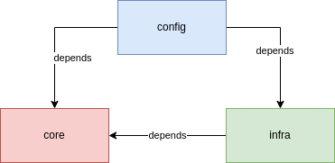

# Template Clean Architecture Spring boot com Java

Template utilizando os conceitos do livro de Clean architecture do Uncle Bob. O princípio do Clean Architecture é tornar o negócio o centro da aplicação e abstrair os detalhes(integrações com banco, web e etc) do negócio.

## Intro

Basicamente as arquiteturas Hexagonal, Clean, DCI e BCE seguem os mesmo principios, mesmo com mudança na forma de estruturar.
* **Independência de frameworks**: Independência de frameworks para estruturar a sua aplicação(evita vendor-lock, amarração a frameworks e outras vantagens a seguir)
* **Testável**: Negócio pode ser testado sem precisar dos detalhes(UI, Banco, Web e etc)
* **Independência de UI e Banco de Dados**: como é centralizado no negócio a mudança parte do stakeholder que é o dono.

## Camadas

* Círculos mais internos são de alto nível e quando mais se chega no centro, menos dependência possuem e mais abstratos eles são.
* Círculos mais externos são de baixo nível, implementação e detalhes concretos quem possuem dependência com circulos mais internos através de abstrações(interfaces)

> Regra de dependência: código dos módulos mais externos devem apontar para os módulos mais interno, através de abstrações.

### Entities
Encapsulam as regras críticas de toda a empresa. Pode ser um objeto com métodos, conjunto de estruturas de dados e funções. Não importa desde de que não esteja atrelada a uma regra de fluxo.

### Use Cases
Contém regras de negócio específicos para aquele fluxo. Encapsula e implementa todas as funcionalidades em casos de uso do sistema. Porta de entrada e saída para execução da regra de fluxo e das regras de entidades para atingir o objetivo do negócio

### Interface Adapters
Responsáveis por converter os dados para o formato dos casos de uso e entidades, depois vice-versa. Assim evita que as estruturas sejam compartilhadas e as camadas conheçam umas as outras

### Frameworks and Drivers
Camada mais externa, composta por frameworks, drivers, ferramentas externas, banco de dados, comunicação com outros serviços e etc.

## Projeto

É um projeto separado em três módulos de nível de organização de projeto:
* [core](core)
  > Responsável pela regra de negócio, é o módulo que não devem de jeito nenhum possuir dependência com outros módulos, ele é o centro da aplicação.
* [infra](infra)
  > Responsável pelas integrações(web, banco, filas, drivers e etc) tanto de entrada quanto de saída, e ele sim deve conhecer e depender do módulo core.
* [config](config)
  > Basicamente é o start(entrypoint) da aplicação e também responsável por compilar todos os módulos em um projeto só.

  

## SOLID

Obviamente Clean Arch e SOLID andam de mãos dadas então é interessante que aplique também os conceitos neste projeto.

1. **SRP**: Single Responsability Principle
2. **OCP**: Open Closed Principle
3. **LSP**: Liskov Substitution Principle
4. **ISP**: Interface Segregation Principle
5. **DIP**: Dependency Inversion Principle

> Existe outra branch que aplica também o clean arch, mas para projetos maiores e que as funcionalidades precisem possuir os seus módulos de core e infra separados. [Veja](tree/sub-module)